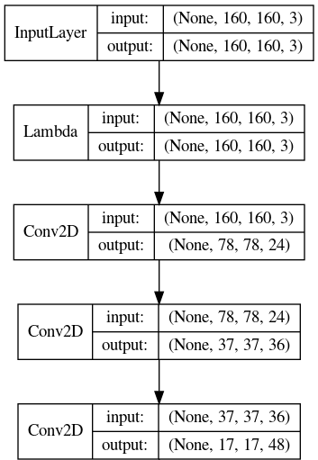

# OSCAR

## History

- 8/26/2021: OPEM4AV 논문 구현
  - LSTM 학습 및 테스트 구현
  - 네트워크 구조 시각화 구현 : `neural_net/net_visualization.py`
  - 차도 중앙좌표 계산함수 및 다양한 지표 구현
  - Multi-GPU 사용시 GPU 번호를 설정하여 학습하는 기능 추가
- 3/11/2021: 
  - Removed unused plugins that are not compatible with Gazebo-11.
  - Works with Gazebo-11 as well. 
  - Tested in Ubuntu 20.04 and ROS Noetic. Only checked basic function and not yet fully tested.
- 3/06/2021: Version 1.6 released
  - Input can have velocity in addition to image. See `config/neural_net [num_input]`. 
  - Output can have throttle in addtion to steering angle. `See config/neural_net [num_output]`.
  - Add `brake` in `config/data_collection` (config version # 0.92 was used previously).
- 2/18/2021: Version 1.5 released.
  - Add 'brake' to the `data_collection`.
  - Update the modules that use data from `data_collection`.
- 01/15/2021: Version 1.4 released.
  - Split one config (neural_net) to three (neural_net, data_collection, run_neural)
- 12/04/2020: Version 1.2 released.
  - New data collection policy.
  - Data normalization added.
- 11/30/2020: Version 1.0 released.

## Introduction
OSCAR는 자율주행연구와 교육을 발전시키기 위한 목적으로 개발된 오픈소스 자율주행 플랫폼입니다.
OSCAR 플랫폼은 UM-Dearborn BIMI lab에서 디자인하였습니다.

OSCAR는 2개의 차량(`fusion`, `rover`)을 지원합니다.
`fusion`은 도요타 프리우스 차량의 에너지효율을 시뮬레이션 테스트하기위해 개발된 OSRF `car_demo`를 기반으로 구현되었습니다.
`rover`의 펌웨어는 PX4 Autopilot이며 현재 구현 중입니다.

<!-- OSCAR is the Open-Source robotic Car Architecture for Research and education. OSCAR is an open-source and full-stack robotic car architecture to advance robotic research and education in a setting of autonomous vehicles.
The OSCAR platform was designed in the Bio-Inspired Machine Intelligence Lab at the University of Michigan-Dearborn. 

The OSCAR supports two vehicles: `fusion` and `rover`.

`fusion` is based on `car_demo` from OSRF that was originally developed to test simulated Toyota Prius energy efficiency.

The backend system of `rover` is the PX4 Autopilot with Robotic Operating System (ROS) communicating with PX4 running on hardware or on the Gazebo simulator.  -->

## Who is OSCAR for?
- OSCAR 플랫폼은 자율주행차와 모바일로봇 연구에서 풀스택 시스템이 필요한 연구진
- OSCAR는 모바일로봇 / 자율주행차량을 수업에 가르치고자하는 교육자
- 로봇 프로그래밍의 원리를 배우기위한 학생

<!-- The OSCAR platform can be used by researchers who want to have a full-stack system for a robotic car that can be used in autonomous vehicles and mobile robotics research.
OSCAR helps educators who want to teach mobile robotics and/or autonomous vehicles in the classroom. 
Students also can use the OSCAR platform to learn the principles of robotics programming. -->

## Download the OSCAR Source Code

```
$ git clone https://github.com/jrkwon/oscar.git --recursive
```

## Directory Structure
- `catkin_ws`: ros workspace
  - `src`
    - `data_collection`: data from front camera and steering/throttle
    - `fusion`: Ford Fusion Energia model
    - `rover`: Developing..
- `config`: configurations
  - `conda`: conda environment files
  - `config.yaml`: config file names for neural_net, data_collection, and run_neural
  - `neural_net`: system settings for neural_net
  - `data_collection`: system settings for data_collection
  - `run_neural`: system settings for run_neural
- `neural_net`: neural network package for end to end learning
- `PX4-Autopilot`: The folder for the PX4 Autopilot.


## Prior to Use

### Versions 

Ubuntu 18.04, ROS Melodic을 사용하여 테스트되었습니다.

### Install ROS packages
Install two more packages for this project unless you already have them in your system.
```
$ sudo apt install ros-$ROS_DISTRO-fake-localization
$ sudo apt install ros-$ROS_DISTRO-joy

```

### Create Conda Environment 

Create a conda environment using an environment file that is prepared at `config/conda`.
```
$ conda env create --file config/conda/environment.yaml
```
### rover only
TBA
This section applies to `rover` which is based on `PX4 `. When RC signal is lost, the vehicle's default behavior is `homing` with `disarming` to protect the vehicle. 
We disabled this feature to prevent the vehicle from disarming whenever control signals are not being sent.

Use QGroundControl to disable the feature. Find `COM_OBLACT` and make it `Disable`.

## How to Use

### Activate Conda Environment

Activate the `oscar` environment. 
```
$ conda activate oscar
```


This section explains how to use `fusion` and `rover`.

### fusion

`fusion` is heavily relied on OSRF's `car_demo` project. Simply use the following script.

```
(oscar) $ ./start_fusion.sh 
```

OSCAR는 자율주행 시뮬레이션을 위해 다양한 GAZEBO `world`를 제공합니다.
- `track_jaerock`: 특정 월드를 선택하지않으면 실행되는 기본 월드입니다.
- `track_jaerock_road` : `track_jaerock`의 도로만 제공하는 월드입니다.  
- `track_test` : OPEM4AV 논문에서 테스트로 사용된 월드입니다.
- `track_test_road` : `track_test`의 도로만 제공하는 월드입니다.
- `sonoma_raceway`: racetrack
- `mcity_jaerock`: mcity

```
(oscar) $ ./start_fusion.sh {track_jaerock|track_test}
```

### rover 
TBA
`rover` is based on the Software-In-The-Loop of PX4.

1. Start the rover

```
(oscar) $ ./start_rover.sh
```

2. Get rover ready to be controlled.

Open a new terminal and run the following shell scripts.
```
(oscar) $ ./cmd_arming.sh
(oscar) $ ./offboard_mode.sh
```

Then the `rover` is ready to be controlled by the topic `/mavros/setpoint_velocity/cmd_vel` or `/mavros/setpoint_velocity/cmd_vel_unstamped`. The `OSCAR` uses the `unstamped` version.

## How to Collect Data

Run the script with a data ID as an argument.
```
(oscar) $ ./collect_data_fusion jaerock
```

The default data folder location is `$(pwd)e2e_{fusion/rover}_data`.

### Data Format

`data_collection` 0.92 이후 버전의 CSV 파일에는 `brake` 컬럼이 하나 더 있습니다.
`convert_csv.py`를 사용하여 0.92 이전 버전에서 수집된 데이터를 이후 버전에서도 사용할 수 있습니다.
<!-- From `data_collection` config version 0.92, the CSV file has one more column for `brake`. Use `convert_csv.py` to convert a data CSV file collected before 0.92 to a new CSV file. -->

#### From Version 0.92

데이터 수집은 이미지와 함께 csv 파일을 저장합니다. csv 파일에는 다음과 같은 컬럼이 있습니다.
<!-- Data Collection will save a csv file with images. The CSV file has following columns -->

```
image_file_name / steering_angle / throttle / brake / linux_time / velocity / velocity_x / velocity_y / velocity_z / position_x / position_y / position_z

```

```
2020-12-08-23-55-31-150079.jpg	-0.0149267930537	0.15	0.7 1607489731.15	0.846993743317	0.846750728334	-0.00903874268025	-0.0181633261171	8.25840907119	-102.836707258	0.0248406100056

```

#### Before Version 0.92

데이터 수집은 이미지와 함께 csv 파일을 저장합니다. csv 파일에는 다음과 같은 컬럼이 있습니다.
<!-- Data Collection will save a csv file with images. The CSV file has following columns -->

```
image_file_name / steering_angle / throttle / linux_time / velocity / velocity_x / velocity_y / velocity_z / position_x / position_y / position_z

```

```
2020-12-08-23-55-31-150079.jpg	-0.0149267930537	0.15	1607489731.15	0.846993743317	0.846750728334	-0.00903874268025	-0.0181633261171	8.25840907119	-102.836707258	0.0248406100056

```

## Data Cleaning

시뮬레이션 환경에서 주행을 하면서 데이터를 수집하다보면 도로를 이탈하는 경우가 발생할 수 있습니다. 이 경우 해당 이미지를 삭제하고 `rebuild_csv.py` 를 실행하여 csv를 재구성 할 수 있습니다.
<!-- When some of test images must be deleted, just delete them and rebuild the csv using `rebuild_csv.py`. -->

```
(oscar) $ python rebuild_csv.py path/to/data/folder
```

## How to Train Neural Network

### steering_angle_scale

`nerual_net` config 안에 `steering_angle_scale` 파라미터는 뉴럴 네트워크의 예측 성능을 높이기 위해 사용됩니다.
steering angle의 범위는 -1 ~ 1 사이 입니다. 그러나 일반적으로 매우 급격한 커브를 하지않는 경우 0.5~1 사이의 값이나 -0.5~-1 사이의 값은 잘 수집되지않습니다.
<!-- `steering_angle_scale` in `neural_net` config is for making the neural network have higher precision in prediction. The range of steering angle is -1 to 1. But in most cases, there will not be values between -1 and -0.5 as well as between 0.5 to 1 which means very sharp steering angles. These sharp steering angles will not be collected from driving a track in practice. -->


To find a proper scale value, you may use `test_data.py` by which you can see data statistics. The following is an example.

The choice of `steering_angle_scale` is especially important when activation functions are `sigmoid` or `tanh` in which you may lose data samples of sharp turns.

```
####### data statistics #########
Steering Command Statistics:
count    6261.000000
mean        0.002407
std         0.134601
min        -0.421035
25%        -0.016988
50%         0.009774
75%         0.085238
max         0.310105
Name: steering_angle, dtype: float64
```

### Training
Start a training
```
(oscar) $ . setup.bash
(oscar) $ python neural_net/train.py path/to/data/folder
```

### Visualize Neural Network Architecture

Keras에서 제공하는 plot_model library를 사용하여 뉴럴네트워크의 구조를 시각화 할 수 있습니다.

```
(oscar) $ python neural_net/net_visualization.py path/to/save/image
```


<br><br>


### TensorBoard

After starting a training session, start tensorboard.
```
(oscar) $ tensorboard --logdir ./logs/scalars/
```

## How to Test Neural Network

TBA
```
(oscar) $ . setup.bash
(oscar) $ python neural_net/test.py path/to/data/model path/to/data/folder
```

To compare labeled steering angles and their corresponding ones.
```
(oscar) $ . setup.bash
(oscar) $ python neural_net/drive_log.py path/to/data/model path/to/data/folder
```

## How to See Saliency Map

TBA
```
(oscar) $ . setup.bash
(oscar) $ python neural_net/test_saliency.py path/to/data/model path/to/image/to/test
```

## How to Drive using Neural Network

TBA
```
(oscar) $ . setup.bash
(oscar) $ rosrun run_neural run_nerual.py path/to/data/model 
```

## How to See Collected Data with/without Inference

### Visualization of Steering Angle Predictions
You can specify a trained neural network model to see how the inference engine is actually working.
```
(oscar) $ python neural_net/drive_view.py path/to/data/model path/to/data/folder path/to/folder/to/save 
```

### Visualization of Collected Data
It is also possible to visualize collected data with other information without steering angle predictions.
```
(oscar) $ python neural_net/drive_view.py path/to/data/folder path/to/folder/to/save 
```

## Sample Datasets

The datasets below were collected before we added `brake`. The CSV files must be converted by `convert_csv.py` before being used.

### New sample datasets (not cropped)
- https://drive.google.com/drive/folders/197w7u99Jvyf5tuRTTawLhaYuwBLSxo-O?usp=sharing

### Legacy sample datasets (cropped)
- https://drive.google.com/drive/folders/173w5kh9h5QCDG8LEJPQ1qGJKwz1TnAkr?usp=sharing

## ROS packages 

```
$ sudo apt install ros-$ROS_DISTRO-hector-gazebo-plugins
```

## Acknowledgments

### System Design and Implementation

- Jaerock Kwon, Ph.D.: Assistant Professor of Electrical and Computer Engineering at the University of Michigan-Dearborn

### Implementation

- Donghyun Kim: Ph.D. student at Hanyang University, Ansan, Korea
- Rohan Pradeepkumar: MS student in Automotive Systems Engineering at the University of Michigan-Dearborn
- Sanjyot Thete: MS student in Data Science at the University of Michigan-Dearborn

### References

- https://github.com/osrf/car_demo
- https://github.com/ICSL-hanyang/uv_base/tree/Go-kart
- https://github.com/PX4/PX4-Autopilot